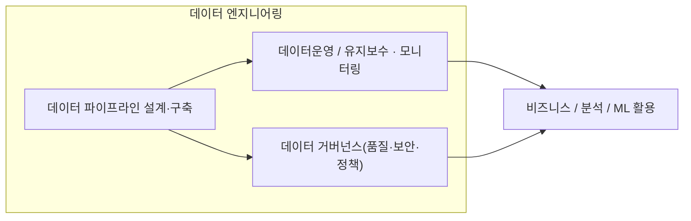
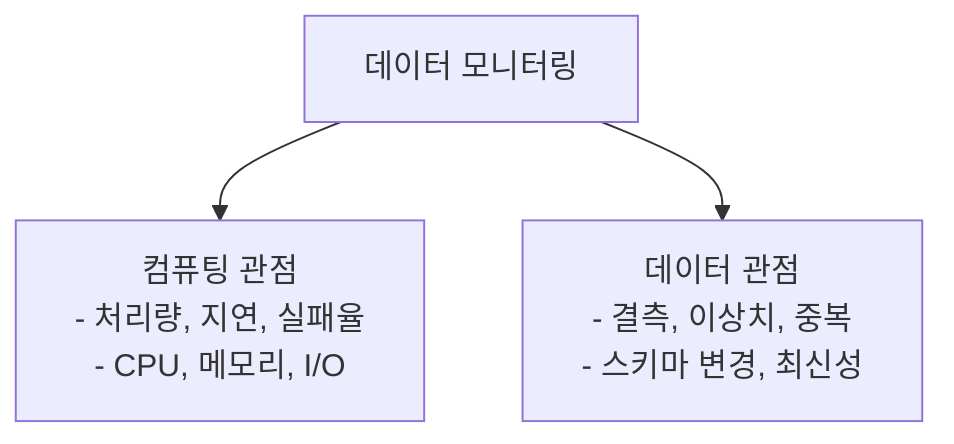
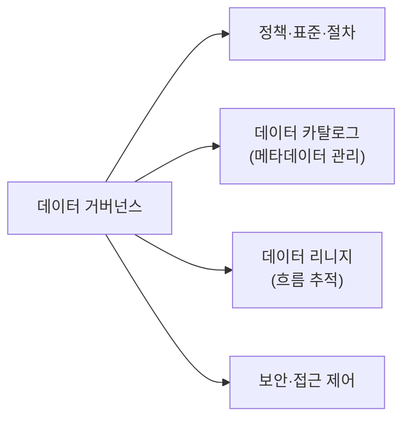
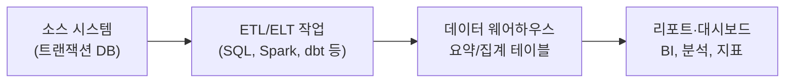

# 데이터 엔지니어링

## 1. 개요
데이터 엔지니어링은 대규모 데이터를 안정적으로 수집·저장·변환·제공하도록 설계하고 운영하는 업무를 수행한다. 데이터 엔지니어는 데이터 파이프라인을 구축하고 확장하며, 데이터 품질과 보안 요구사항을 충족하도록 관리한다. 또한 조직이 데이터를 효율적으로 활용하도록 데이터 거버넌스 체계를 운영한다.

---

## 2     데이터 파이프라인 개요
데이터 파이프라인은 다양한 데이터 소스에서 데이터를 수집하고, 저장소로 적재한 후, 분석이나 활용이 가능한 형태로 변환하여 제공하는 **전체 데이터 처리 흐름**을 의미한다.

대표적 단계는 다음과 같다.

1. 데이터 수집(ingestion)
2. 데이터 저장(레이크 & 웨어하우스)
3. 데이터 변환(ETL/ELT)
4. 오케스트레이션(자동화)

파이프라인 전체를 설계하고 자동화하는 것이 데이터 엔지니어의 핵심 업무이다.  
[참고 링크](https://www.ibm.com/kr-ko/think/topics/data-pipeline)

## 2.1 단계별 상세 설명
### 2.1.1 데이터의 수집 
데이터 수집은 애플리케이션, 디바이스, 데이터베이스 등 다양한 소스에서 데이터를 가져오는 과정입니다.
실시간 스트리밍 또는 주기적 배치를 사용하며, API 호출, 웹훅, 데이터 복제 방식 등이 활용됩니다. [링크](https://aws.amazon.com/ko/what-is/data-pipeline/)

### 2.1.2 데이터 레이크
데이터 레이크는 구조화되지 않은 데이터를 포함한 다양한 형태의 데이터를 저장할 수 있다. 이는 데이터 레이크가 유연한 스키마를 지원하기 때문이다. 왜냐하면 데이터 레이크는 다양한 데이터 소스를 통합할 수 있기 때문이다.
이를 위해 적절한 데이터 통합 및 표준화를 보장하는 필터링, 마스킹 및 집계와 같은 데이터 변환이 포함된다. [링크](https://f-lab.kr/insight/data-warehouse-vs-data-lake-20240803?gad_source=1&gad_campaignid=22368870602&gbraid=0AAAAACGgUFdSasQRivlxu3XT9EYtcDxxe&gclid=Cj0KCQiAubrJBhCbARIsAHIdxD85DK5ZIEMF8RmVLNxg6jP8ELMhUpyCZQ598pp96fXMRvLpsZ4IfswaAvaHEALw_wcB)

### 2.1.3 데이터의 변환
데이터 변환은 데이터를 통합된 형식이나 구조로 변경하여 품질 및 활용성을 높이는 과정이다.
대상 시스템과의 호환성을 보장하고, 통합 분석에 필요한 공통 규칙을 적용한다.
.[링크](https://www.ibm.com/kr-ko/think/topics/data-transformation)

### 2.1.4 데이터 웨어하우스
데이터 웨어하우스와 데이터 레이크는 데이터 저장 및 분석을 위한 두 가지 주요 아키텍처이다. 데이터 웨어하우스는 구조화된 데이터를 저장하고 분석하는 데 중점을 둔다. 왜냐하면 데이터 웨어하우스는 정형 데이터에 최적화되어 있기 때문이다.

### 2.1.5 오케스트레이션
데이터 오케스트레이션의 핵심은 서로 다른 시스템에서 데이터 흐름을 자동화, 조정 및 관리하는 프로세스이다. 이러한 포괄적인 접근 방식은 데이터 수집(원시 데이터 수집 프로세스)부터 변환(데이터를 사용 가능한 형식으로 변환), 통합 및 궁극적으로 적절한 시스템 또는 최종 사용자에게 제공하는 모든 것을 포함한다.

수동 개입에 크게 의존하는 기존 데이터 관리와 달리, 데이터 오케스트레이션은 자동화를 활용하여 효율성을 향상시키고 오류를 줄이며 운영을 확장한다. 이러한 차별화는 오늘날의 데이터 집약적인 비즈니스 환경에서 매우 중요하다.

[링크](https://www.purestorage.com/kr/knowledge/what-is-data-orchestration.html)

## 3 데이터의 유지보수 및 모니터링
데이터 파이프라인은 구축 이후에도 운영 문제, 데이터 품질 이슈, 스키마 변경, 비용 증가 등 다양한 리스크가 발생한다.따라서 지속적인 유지보수와 모니터링은 운영 안정성 확보를 위해 필수적이다.
### 3.1 데이터 유지보수
데이터 유지보수는 파이프라인과 저장된 데이터가 비즈니스·시스템 변화에도 불구하고 올바르게 동작하고 의미를 잃지 않도록 관리하는 일이다. 예를 들면 다음과 같다.

- 소스 시스템의 스키마 변경에 맞춘 파이프라인 수정
- 잘못 적재된 데이터의 정정, 중복 제거, 백필(누락 구간 채우기)
- 오래된 데이터의 아카이빙 및 보관 주기 관리
- 비즈니스 규칙 변경에 따른 집계 로직 및 변환 규칙 업데이트
- 사용되지 않는 테이블·컬럼 정리 및 구조 리팩토링

#### 3.1.1 데이터 유지보수가 필요한 이유

### 3.2 데이터 모니터링
데이터 모니터링은 성능, 정확성, 일관성 및 신뢰성 측면에서 조직의 데이터를 평가, 측정 및 관리하는 것을 말한다.  데이터 모니터링의 평가는 크게 두가지 관점에서 우리는 이해할 수 있습니다. 컴퓨터 리소스 관점에서 그리고  도메인 관점에서 생각이 가능하다.[링크](https://www.siffletdata.com/blog/data-pipeline-monitoring?utm_source=chatgpt.com)

#### 3.2.1 컴퓨터 리소스 관점에서의 데이터 모니터링
컴퓨터 리소스  관점에서는 파이프라인의 처리량·지연·실패율·CPU/메모리 사용량 등 시스템 성능·안정성을 모니터링해 “파이프라인이 제시간에, 안 끊기고, 적절한 자원으로 도는지”를 확인한다.

#### 3.2.2 도메인 관점에서의 데이터 모니터링
결측·이상치·중복·스키마 변경·데이터 최신성 등 정확성·완전성·일관성 같은 품질 지표를 통해 “실제로 흘러가는 데이터가 신뢰할 만한지(Garbage in, Garbage out을 막을 수 있는지)”를 확인하는 데 초점을 둔다.

## 4 데이터 거버넌스
데이터 거버넌스는 조직 데이터의 품질·보안·가용성을 관리하기 위한 제도적 프레임워크이다.
이는 데이터 카탈로그, 리니지, 접근 제어, 정책, 표준, 책임 구조 등을 포함하며
데이터 운영의 지속적인 신뢰성과 투명성을 보장한다.

### 4.1 데이터 거버넌스가 필요한 이유
데이터 신뢰성 확보: 거버넌스가 있으면 누가, 언제, 어떻게 데이터를 만들고 수정했는지 명확해져서, 분석·리포트·의사결정에 사용되는 데이터의 신뢰도가 높아진다.[링크](https://www.ibm.com/kr-ko/think/topics/data-governance?utm_source=chatgpt.com)

보안 및 규정 준수 (Compliance): 개인정보, 민감 정보, 규제 대상 데이터 등을 다루는 경우, 데이터 수명 주기 전반에 대한 통제와 기록이 필요하다. 거버넌스를 통해 접근 제어, 감사(audit), 프라이버시 정책, 보안 절차 등을 체계화할 수 있다.[링크](https://docs.databricks.com/aws/en/lakehouse-architecture/data-governance/best-practices?utm_source=chatgpt.com)

중복·사일로 방지 및 데이터 일관성 유지: 데이터가 여러 부서/팀/시스템에 흩어지고 중복되거나 버전이 달라지는 것을 막고, 하나의 ‘신뢰 가능한 단일 출처(Single Source of Truth)’를 유지하게 해준다.[링크](https://www.databricks.com/kr/discover/data-governance?utm_source=chatgpt.com)

운영 효율성, 비용 절감, 의사결정 속도 향상: 잘 정립된 거버넌스는 데이터 관리 절차를 표준화하고 자동화 가능하게 해, 중복 작업을 줄이고 데이터 활용을 가속화한다.[링크](https://www.databricks.com/kr/discover/data-governance?utm_source=chatgpt.com)

#### 4.1.1 데이터 카탈로그 관리
데이터 카탈로그는 조직 내 존재하는 모든 데이터 자산(metadata 포함)을 중앙에 정리해 두는 저장소이다.

어떤 데이터셋이 있는지, 그 구조(schema), 설명(description), 소유자, 민감도, 사용처 등을 기록 → 데이터 검색·이해·재사용이 쉬워진다. 

분석가, 데이터 과학자, 비즈니스팀 등 다양한 사용자들이 공통된 언어로 데이터 탐색 가능하다

데이터 자산에 보안 정책, 접근 제어, 거버넌스 정책 등을 연계하면 거버넌스 체계의 중심 역할 담당한다.

[링크](https://aws.amazon.com/ko/what-is/data-catalog/)

##### 4.1.1.1 데이터 카탈로그 관리 기술

#### 4.1.2 데이터 리니지
데이터 리니지 는 데이터의 출처 → 변환 → 사용 까지 흐름을 추적하고 개념이다.

데이터가 어디서 왔고, 어떤 변환을 거쳐, 어디로 쓰이는지 파악 → 투명성 확보, 신뢰성 향상 

변환 로직 변경, 스키마 변경, 오류 발생 시 영향 범위(impact) 를 빠르게 분석 가능 → 안정적 운영과 리스크 관리에 필수 

규제 준수, 감사(audit), 데이터 품질 보증, 개인정보 보호 등 거버넌스 요구사항 대응 가능 

[링크](https://www.ibm.com/kr-ko/think/topics/data-lifecycle-management) 

##### 4.2.1 데이터 리니지 기술 

[이동](./DataEngineering_Stacks.md)
[이동](Datagovernance.md)