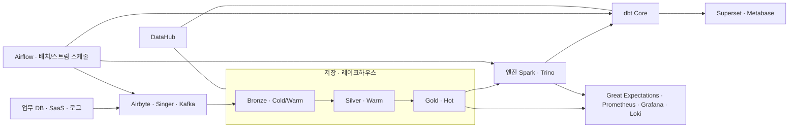

# 데이터 파이프라인 구축 문서

## 1. 데이터 거버넌스

### 1.1 거버넌스 툴 및 원칙 선택
  - DataHub
  - 선택 이유
    - 테이블·컬럼 메타데이터, 계보(lineage), 소유자 정보, 태그 등을 한 곳에서 관리할 수 있어 거버넌스 허브로 사용 가능.
    - Hive/Trino, Kafka, dbt, Airflow, BI 도구 등 다양한 오픈소스·클라우드 스택과 공식/비공식 통합이 이미 존재해, 파이프라인 전 구간의 메타데이터를 자동 수집하기 용이함.
    - 확장 가능한 ingestion 프레임워크 덕분에, 이후 스택이 바뀌더라도 커넥터만 추가해서 계속 같은 카탈로그를 유지할 수 있음. 
### 1.2 거버넌스 실행 (프로세스/조직 적용)
### 1.3 결과 및 피드백 (지표/개선 사항)

## 2. 전체 아키텍처 및  설계

### 2.1 아키텍처 방향 및 레이어 설계
본 데이터 파이프라인은 레이크하우스(Lakehouse) 기반 아키텍처를 채택하며, 저장 계층은 크게 두 가지 관점의 레이어링을 적용한다.

1. 메달리온(Medallion) 아키텍처
   - Bronze 레이어  
     - 원시(raw) 데이터가 수집되는 계층으로, 소스 시스템의 구조와 내용을 가능한 한 그대로 유지한다.  
     - 스키마 품질, 결측치, 중복 등이 정제되지 않은 상태로 적재하며, 추후 재처리·재검증을 위해 원본 보존 목적이 강하다.  
   - Silver 레이어  
     - 정합성 검증, 기본적인 클렌징, 참조 무결성 체크 등을 거친 “클린(cleaned) 데이터” 계층이다.  
     - 비즈니스 로직을 일부 반영해 조인·정규화/비정규화된 테이블을 구성하며, 도메인별 공용 데이터셋(표준 뷰)의 역할을 한다.  
   - Gold 레이어  
     - 리포트, 대시보드, 지표 계산, 특정 업무 시스템에서 바로 활용할 수 있게 설계된 “소비 전용” 데이터 계층이다.  
     - 스타 스키마(팩트/디멘전)나 서머리 테이블, 마트(Mart) 형태로 구성되며, 성능·가독성을 우선한다.

2. Hot/Warm/Cold 스토리지 티어링
   - Hot 데이터  
     - 최근 기간(예: 최근 7~30일)처럼 조회 빈도가 높고 실시간/준실시간 분석에 사용되는 데이터.  
     - 빠른 응답 시간과 높은 IOPS를 제공하는 스토리지 계층에 두고, 쿼리 엔진이 우선적으로 이 계층을 타도록 파티셔닝·인덱싱을 설계한다.  
   - Warm 데이터  
     - 조회 빈도는 Hot보다 낮지만, 월간/분기별 분석, 트러블슈팅, 리트로스펙티브 등에 주기적으로 사용되는 데이터.  
     - 상대적으로 비용이 낮은 스토리지 계층에 두되, 여전히 직접 쿼리가 가능한 형태로 유지한다.  
   - Cold 데이터  
     - 법적/컴플라이언스 또는 아카이빙 목적 등으로 장기간 보존해야 하지만, 실제 조회는 거의 발생하지 않는 데이터.  
     - 비용 최적화가 우선인 계층에 장기 보관하며, 필요 시 복원 절차를 통해 상위 계층으로 승격(promote)하여 분석 가능한 상태로 가져오는 것을 전제로 한다.

3. 메달리온과 Hot/Warm/Cold의 결합 전략
   - 논리 레이어(Bronze/Silver/Gold)와 물리 스토리지 티어(Hot/Warm/Cold)를 1:1로 고정 매핑하지 않고, 다음과 같은 원칙으로 유연하게 매핑한다.
     - 최근 데이터가 많이 사용되는 Gold/Silver 테이블의 최신 파티션은 Hot 계층에 두고, 오래된 파티션은 Warm/Cold로 이동(티어링)한다.
     - Bronze 레이어는 원본 보존이 목적이므로 주로 Warm/Cold 계층에 위치시키되, 최근 데이터만 Hot에 일부 유지하여 재처리 시 I/O 부담을 줄인다.
   - 이 구조를 통해
     - 논리적 관점에서는 “메달리온 패턴”으로 데이터의 가공 단계와 품질 수준을 명확히 구분하고,
     - 물리적 관점에서는 “Hot/Warm/Cold 티어링”으로 비용·성능을 균형 있게 관리한다.

4. 메타데이터·거버넌스 관점
   - 각 레이어(Bronze/Silver/Gold)와 티어(Hot/Warm/Cold)는 메타데이터 상에서 명시적으로 태깅·분류하여 관리한다.
   - 메타데이터 카탈로그(예: DataHub)에는
     - 데이터셋이 속한 메달리온 레이어 정보,
     - 현재 주 스토리지 티어(H/W/C),
     - 보존 기간(Retention 정책)  
     등을 속성으로 기록하여, 운영·분석·비용 관리 측면에서 일관된 가시성을 확보한다.
### 2.2 기술 스택/구성요소 선택
- Ingestion: Airbyte OSS, Singer 기반 커스텀 커넥터
- Streaming: Apache Kafka (+ 필요 시 Pulsar)
- Storage / Lakehouse: Object Storage + Iceberg/Delta/Hudi
- Query Engine: Trino, Apache Spark SQL
- Transform / Modeling: dbt Core, Spark ETL
- Orchestration: Apache Airflow, Dagster
- Data Governance: DataHub OSS
- Data Quality: Great Expectations, Soda Core
- Monitoring & Logging: Prometheus, Grafana, Loki/OpenSearch

### 2.3 결과 및 피드백 (성능/확장성/운영성)

## 3. 데이터 소스 및 수집

### 3.1 수집 스택 및 전략 선택 

- 오픈소스 우선 선택
  - 배치/CDC 수집: Airbyte OSS    
  - 실시간 이벤트 스트리밍: Apache Kafka

- 선택 이유
  - Airbyte OSS  
    - 600개 이상 소스·목적지 커넥터를 제공하는 오픈코어/오픈소스 ELT 플랫폼으로, 대부분의 DB·SaaS·파일 소스를 커버 가능.
    - 커넥터가 전부 오픈소스라 필요 시 포크 후 내부 용도에 맞게 수정 가능. 
    - 목적지를 DW·레이크(Iceberg/Delta 등)로 통일해두면, 해당 계층을 DataHub에서 스캔하는 것만으로 수집 계층의 결과물이 계보에 자동 편입됨. 

  - Singer (Tap/Target)  
    - JSON 기반 표준 프로토콜(tap/target)로, 스펙만 맞추면 어떤 소스·목적지도 조합 가능해 틈새/레거시 소스 수집에 적합. 
    - 오픈소스 구현체와 예제가 많아, 내부용 커스텀 tap/target을 비교적 부담 없이 개발할 수 있음. 

  - Apache Kafka  
    - 대규모 이벤트 스트리밍·로그 수집 표준으로 자리 잡아, 실시간 트래픽/이벤트를 중앙 버스로 모으는 데 적합.  
    - Kafka 토픽을 DataHub에서 데이터셋처럼 인식할 수 있는 통합이 있어, “소스 스트림 → DW 테이블 → 마트”까지 엔드 투 엔드 계보 구성이 가능함. 

- 전략 개요
  - 정기 배치/CDC는 Airbyte 중심, 특수/레거시는 Singer, 실시간 이벤트는 Kafka로 이원화.  
  - 모든 수집 결과는 레이크하우스 계층으로 수렴시키고, DataHub가 해당 스토리지·쿼리 엔진 메타데이터를 인식하도록 구성해 거버넌스 일관성 확보.

---
### 3.2 수집 파이프라인 구현 및 실행 (배치/스트리밍 플로우)
### 3.3 결과 및 피드백 (누락/지연/에러, 개선 사항)

## 4. 데이터 저장 및 모델링

### 4.1 저장/쿼리 스택 및 모델링 전략 선택 

- 오픈소스 우선 선택
  - 저장 계층
    - 오브젝트 스토리지  
    - 오픈 테이블 포맷: Apache Iceberg, Delta Lake, Apache Hudi
  - 쿼리 엔진
    - Trino (대화형/Ad-hoc/BI 쿼리)  
    - Apache Spark SQL (대량 배치 처리·ML·복합 ETL)

- 선택 이유
  - 오픈 테이블 포맷(Iceberg/Delta/Hudi)  
    - Parquet 같은 파일 포맷 위에 메타데이터 레이어를 얹어 ACID 트랜잭션, 스키마/파티션 진화, 타임 트래블 등 DB급 기능을 제공함. 
    - 여러 엔진(Spark, Trino 등)에서 공통으로 접근 가능해 쿼리 엔진을 바꾸더라도 테이블 포맷을 유지할 수 있어 벤더 종속성을 줄임. 
    - Iceberg/Delta/Hudi 메타데이터는 Hive/Trino 카탈로그 등에 노출되므로, DataHub에서 카탈로그를 스캔하여 테이블·스키마·계보 정보를 수집하기 용이함. 

  - Trino  
    - 다양한 데이터 소스를 단일 SQL 인터페이스로 조회하는 분산 쿼리 엔진으로, 레이크하우스( Iceberg/Delta/Hudi )와 DW를 동시에 붙여 통합 분석용 계층을 만들 수 있음.
    - 카탈로그/스키마/테이블 메타데이터를 DataHub가 읽어올 수 있어, “쿼리 뷰·데이터마트 계층”까지 계보를 확장할 수 있음. 

  - Apache Spark  
    - ETL·머신러닝·대량 배치 처리에 특화된 범용 분산 엔진으로, Iceberg/Delta/Hudi를 직접 읽고 쓰는 커넥터를 제공함.
    - DataHub와의 통합(잡 메타데이터, Spark SQL 카탈로그 연동)을 통해 “어떤 Spark 잡이 어떤 테이블을 생성/갱신했는지”를 계보로 표현할 수 있음.   

- 모델링 전략 개요
  - 저장 계층: Raw/Bronze → Cleansed/Silver → Mart/Gold 형태의 메달리온 패턴을 Iceberg/Delta/Hudi 테이블로 구현.{index=14}  
  - 논리 모델링: 도메인 기준 차원/팩트 모델 또는 Data Vault 기반 구조를 설계하고, 상위 계층(뷰·마트)은 Trino 뷰/dbt 모델로 일관되게 관리.

---
### 4.2 저장 계층/스키마 구현 및 실행 (Raw/Bronze ~ Mart/Gold)
### 4.3 결과 및 피드백 (쿼리 성능, 유연성, 비용)

## 5. 데이터 처리 및 오케스트레이션

### 5.1 처리/오케스트레이션 스택 선택

- 오픈소스 우선 선택
  - 변환/모델링
    - dbt Core (SQL 변환·테스트·문서화)  
    - Apache Spark (대량 배치 ETL, 복잡 변환, ML 파이프라인)
  - 오케스트레이션
    - Apache Airflow  
    - Dagster (선택적: 파이프라인 구조를 더 엄격하게 관리하고 싶을 때)

- 선택 이유
  - dbt Core  
    - SQL 기반 변환을 모델 단위로 관리하고, 테스트·문서화를 코드와 함께 버전 관리할 수 있는 오픈소스 표준 도구.
    - Iceberg/Delta/Hudi, Trino, Spark, DW 등 다양한 플랫폼 어댑터가 존재해 레이크하우스 상단의 비즈니스 로직 계층을 일관되게 관리 가능. : 
    - dbt manifest/run 결과를 DataHub가 ingestion하면, 모델 간 계보 및 테스트 결과를 메타데이터로 통합 관리할 수 있음(일반적인 오픈 메타데이터 플랫폼 패턴과 동일).

  - Apache Spark  
    - 대규모 배치 처리를 위한 사실상 표준 엔진으로, ETL 및 피처 엔지니어링 작업을 하나의 스택에서 처리 가능. 
    - Spark 잡 실행 이력·카탈로그를 메타데이터 플랫폼과 연동하면, “ETL 단계 → 결과 테이블” 계보를 자동화하는 데 유리함. 

  - Apache Airflow  
    - DAG 기반 워크플로우 관리의 사실상 표준으로, 다양한 연동(데이터베이스, 클라우드 서비스, ETL 도구)을 위한 오퍼레이터 생태계가 잘 정리되어 있음. 
    - DataHub와의 통합 사례가 풍부해, DAG/Task 단위로 메타데이터를 수집하고 “어떤 DAG가 어떤 데이터셋을 생성/갱신하는지”를 계보로 표현하기 쉬움. 

  - Dagster  
    - 타입이 있는 자산(asset) 단위 파이프라인 설계에 강점이 있어, 데이터셋·파이프라인 관계를 명확히 정의하기에 용이함. (일반적인 오픈 메타데이터 플랫폼에서 Dagster 통합이 점차 확대되는 추세) 

- 전략 개요
  - “변환 로직은 dbt, 대량/복잡 처리는 Spark, 오케스트레이션은 Airflow/Dagster”로 역할 분리.  
  - 모든 파이프라인 정의와 실행 이력을 DataHub에 연결해, 파이프라인 관점에서 전체 데이터 계보를 추적.

---
### 5.2 워크플로우 구현 및 실행 (스케줄, 의존성, 재처리 전략)
### 5.3 결과 및 피드백 (안정성, 운영 난이도, MTTR 등)

## 6. 데이터 품질 관리

### 6.1 품질 도구 및 지표/룰 선택 (오픈소스 우선)

- 오픈소스 우선 선택
  - 규칙 기반 데이터 품질
    - Great Expectations (GX Core)  
    - Soda Core  
    - dbt tests (스키마·무결성·비즈니스 룰 테스트)
  - 품질 지표
    - 결측/이상치 비율, 중복률, 참조 무결성 등 도메인별 핵심 지표 정의

- 선택 이유
  - Great Expectations (GX Core)  
    - 가장 널리 사용되는 오픈소스 데이터 품질 프레임워크 중 하나로, “Expectation”이라는 선언적 룰로 스키마·범위·분포 등을 검증.
    - Airflow·Spark·dbt 등과 연동 사례가 많아 기존 파이프라인에 품질 검증 단계를 자연스럽게 삽입 가능. 

  - Soda Core  
    - 오픈소스 CLI/파이썬 라이브러리로, SodaCL을 이용해 SQL로 번역 가능한 품질 체크를 정의하고 실행할 수 있음.   
    - 데이터 웨어하우스/레이크에서 직접 품질 검증을 수행하고, 결과를 로그·대시보드·알람으로 연계하기 용이함.  

  - dbt tests  
    - dbt 모델 정의에 바로 테스트를 붙일 수 있어, 스키마·관계·유일성·비즈니스 룰을 코드 수준에서 함께 관리 가능. 

  - DataHub 연동성
    - 메타데이터 플랫폼에서 Great Expectations·dbt·오케스트레이션 도구와의 통합을 통해, “어떤 테이블에 어떤 품질 룰이 적용되고, 최근 품질 상태가 어떤지”를 중앙에서 조회할 수 있는 패턴이 일반화되어 있음. 

- 전략 개요
  - 핵심 도메인 테이블부터 GX/Soda/dbt tests를 조합해 필수 품질 룰을 정의.  
  - 품질 결과를 모니터링 시스템/알람 및 DataHub(메타데이터)와 연결하여, 품질 이슈를 계보·소유자 관점에서 추적 가능하게 설계.
### 6.2 품질 검증/모니터링 구현 및 실행 (파이프라인 연동)
### 6.3 결과 및 피드백 (품질 지표 변화, 이슈 대응 사례)

## 7. 보안, 권한 및 컴플라이언스
### 7.1 보안/권한/규제 대응 전략 및 도구 선택
### 7.2 권한 관리/마스킹/감사 로그 구현 및 실행
### 7.3 결과 및 피드백 (감사 대응, 보안 이슈 등)

## 8. 모니터링 및 운영

### 8.1 모니터링/로그 스택 및 지표 선택 (오픈소스 우선)

- 오픈소스 우선 선택
  - 메트릭 수집·저장: Prometheus  
  - 대시보드/알람: Grafana  
  - 로그 수집·집계: Grafana Loki 또는 OpenSearch

- 선택 이유
  - Prometheus + Grafana  
    - Prometheus는 시계열 메트릭 수집/저장을 위한 오픈소스 모니터링 시스템으로, PromQL을 통해 유연한 쿼리·알람 정의가 가능.
    - Grafana는 시각화·대시보드 레이어로, Prometheus와 함께 OSS 모니터링 스택의 사실상 표준 조합으로 쓰이고 있음. 
  - Grafana Loki  
    - Prometheus 철학을 그대로 로그에 적용한 오픈소스 로그 집계 시스템으로, 로그 내용 전체가 아니라 메타데이터 라벨만 인덱싱하여 비용 효율적인 운영이 가능.  
    - Grafana와 자연스럽게 통합되어, 메트릭 알람에서 바로 대응되는 로그로 피벗하는 운영 패턴을 구현하기 좋음. 

  - OpenSearch  
    - Apache 2.0 라이선스의 오픈소스 검색·분석 스위트로, 로그·APM·검색 등 다양한 데이터의 검색·시각화에 활용 가능.
    - OpenSearch Dashboards를 활용해 운영/보안 관점의 분석 대시보드를 구성할 수 있음.  

  - DataHub 연동성
    - 파이프라인/테이블 단위 메타데이터와 Prometheus/Grafana, 로그 스택을 조합하면 “특정 데이터셋의 품질 또는 지연 이슈 → 관련 파이프라인·인프라 메트릭·로그로 바로 점프하는” 운영 UX 구성이 가능함. 

- 지표 선택 개요
  - 파이프라인 지표: 실패율, 지연 시간, 재처리 빈도, 런타임, 리소스 사용량.  
  - 데이터 지표: 레코드 수, 증가율, 품질 에러 건수, SLA 위반 횟수.  
  - 서비스 지표: 주요 도메인별 대시보드 조회 수, 테이블/리포트 사용량 등.

---

### 8.2 운영 모니터링/장애 대응 구현 및 실행
### 8.3 결과 및 피드백 (운영 안정성, 알람 품질, 운영 비용)

## 9. 성과 평가 및 향후 계획
### 9.1 평가 기준 및 도구/데이터 선택 (KPI, SLA, 사용성 지표 등)
### 9.2 성과 평가 및 분석 실행
### 9.3 결과 및 피드백, 향후 로드맵 (고도화/확장 계획)