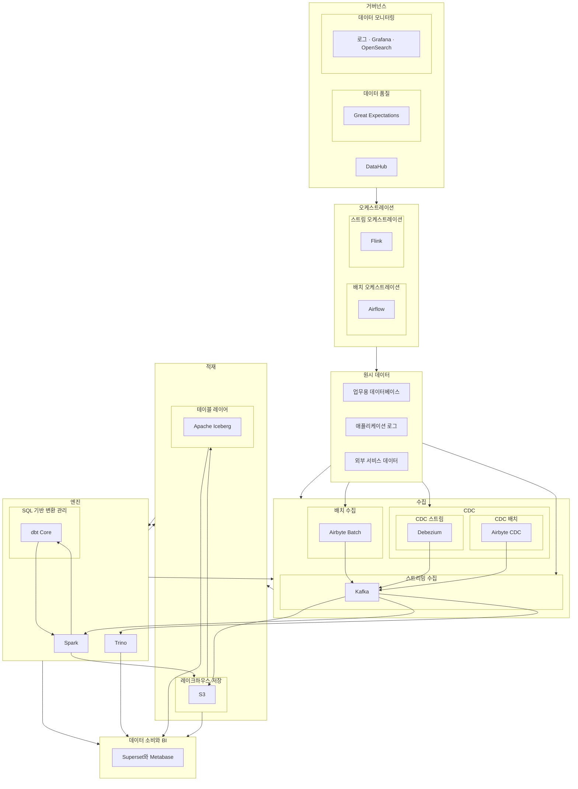

# DataHub 중심 파이프라인 스택 

DataHub 중심 파이프라인 스택
## Table of Contents
## Table of Contents
- [1. 거버넌스 / Governance (DataHub)](#1-거버넌스--governance-datahub)
  - [1-1. 기본 선택](#1-1-기본-선택)
  - [1-2. 대체 가능한 오픈소스](#1-2-대체-가능한-오픈소스)
  - [1-3. DataHub 관점: DataHub가 거버넌스 레이어에 적합한 이유](#1-3-datahub-관점-datahub가-거버넌스-레이어에-적합한-이유)

- [2. 오케스트레이션 / Orchestration (Batch · Stream)](#2-오케스트레이션--orchestration-batch--stream)
  - [2-1. 배치 오케스트레이션 / Batch Orchestration](#2-1-배치-오케스트레이션--batch-orchestration)
    - [2-1-1. 기본 선택 (다이어그램 상)](#2-1-1-기본-선택-다이어그램-상)
    - [2-1-2. 대체 가능한 오픈소스](#2-1-2-대체-가능한-오픈소스)
    - [2-1-3. DataHub 관점: Airflow 중심으로 보는 이유](#2-1-3-datahub-관점-airflow-중심으로-보는-이유)
  - [2-2. 스트림 오케스트레이션 / Stream Orchestration](#2-2-스트림-오케스트레이션--stream-orchestration)
    - [2-2-1. 기본 선택 (개념상)](#2-2-1-기본-선택-개념상)
    - [2-2-2. 대체/보조 패턴](#2-2-2-대체보조-패턴)
    - [2-2-3. DataHub 관점: 스트림 오케스트레이션의 위치](#2-2-3-datahub-관점-스트림-오케스트레이션의-위치)

- [3. 데이터 품질 / Data Quality (Great Expectations)](#3-데이터-품질--data-quality-great-expectations)
  - [3-1. 기본 선택](#3-1-기본-선택)
  - [3-2. 대체 가능한 오픈소스](#3-2-대체-가능한-오픈소스)
  - [3-3. DataHub 관점: GE가 좋은 이유](#3-3-datahub-관점-ge가-좋은-이유)

- [4. 데이터 모니터링 / Monitoring (Grafana, OpenSearch)](#4-데이터-모니터링--monitoring-grafana-opensearch)
  - [4-1. 기본 선택](#4-1-기본-선택)
  - [4-2. 대체 가능한 오픈소스](#4-2-대체-가능한-오픈소스)
  - [4-3. DataHub 관점: Grafana + OpenSearch를 유지하는 이유](#4-3-datahub-관점-grafana--opensearch를-유지하는-이유)

- [5. CDC / Change Data Capture (배치 CDC · 스트리밍 CDC)](#5-cdc--change-data-capture-배치-cdc--스트리밍-cdc)
  - [5-1. 배치 CDC / Batch CDC (쿼리 기반 CDC)](#5-1-배치-cdc--batch-cdc-쿼리-기반-cdc)
    - [5-1-1. 기본 선택](#5-1-1-기본-선택)
    - [5-1-2. 대체 가능한 오픈소스](#5-1-2-대체-가능한-오픈소스)
    - [5-1-3. DataHub 관점: 배치 CDC](#5-1-3-datahub-관점-배치-cdc)
  - [5-2. 스트리밍 CDC / Streaming CDC (로그 기반 CDC)](#5-2-스트리밍-cdc--streaming-cdc-로그-기반-cdc)
    - [5-2-1. 기본 선택](#5-2-1-기본-선택)
    - [5-2-2. 대체 가능한 오픈소스](#5-2-2-대체-가능한-오픈소스)
    - [5-2-3. DataHub 관점: 스트리밍 CDC](#5-2-3-datahub-관점-스트리밍-cdc)

- [6. 배치 수집 / Batch Ingestion (Airbyte)](#6-배치-수집--batch-ingestion-airbyte)
  - [6-1. 기본 선택](#6-1-기본-선택)
  - [6-2. 대체 가능한 오픈소스](#6-2-대체-가능한-오픈소스)
  - [6-3. DataHub 관점: Airbyte 단일 배치 수집이 유리한 이유](#6-3-datahub-관점-airbyte-단일-배치-수집이-유리한-이유)

- [7. 스트리밍 수집 / Streaming Ingestion (Kafka)](#7-스트리밍-수집--streaming-ingestion-kafka)
  - [7-1. 기본 선택](#7-1-기본-선택)
  - [7-2. 대체 가능한 오픈소스](#7-2-대체-가능한-오픈소스)
  - [7-3. DataHub 관점: Kafka를 스트리밍 기본값으로 두는 이유](#7-3-datahub-관점-kafka를-스트리밍-기본값으로-두는-이유)

- [8. SQL 기반 변환 관리 (dbt Core)](#8-sql-기반-변환-관리-dbt-core)
  - [8-1. 기본 선택](#8-1-기본-선택)
  - [8-2. 대체 가능한 오픈소스](#8-2-대체-가능한-오픈소스)
  - [8-3. DataHub 관점: dbt 통합을 기본 전제로 두는 이유](#8-3-datahub-관점-dbt-통합을-기본-전제로-두는-이유)

- [9. 저장 / 레이크하우스 Storage (S3)](#9-저장--레이크하우스-storage-s3)
  - [9-1. 기본 선택](#9-1-기본-선택)
  - [9-2. 대체 가능한 오픈소스/서비스](#9-2-대체-가능한-오픈소스서비스)
  - [9-3. DataHub 관점: S3 기반 레이크하우스가 유리한 이유](#9-3-datahub-관점-s3-기반-레이크하우스가-유리한-이유)

- [10. 테이블 레이어 / Table Layer (Apache Iceberg)](#10-테이블-레이어--table-layer-apache-iceberg)
  - [10-1. 기본 선택](#10-1-기본-선택)
  - [10-2. 대체 가능한 오픈소스](#10-2-대체-가능한-오픈소스)
  - [10-3. DataHub 관점: Iceberg를 테이블 레이어 기본으로 두는 이유](#10-3-datahub-관점-iceberg를-테이블-레이어-기본으로-두는-이유)

- [11. 엔진 / Processing & Query Engines (Spark, Trino)](#11-엔진--processing--query-engines-spark-trino)
  - [11-1. 기본 선택](#11-1-기본-선택)
  - [11-2. 대체 가능한 오픈소스](#11-2-대체-가능한-오픈소스)
    - [11-2-1. Spark 대체](#11-2-1-spark-대체)
    - [11-2-2. Trino 대체](#11-2-2-trino-대체)
  - [11-3. DataHub 관점: Spark + Trino 조합이 유리한 이유](#11-3-datahub-관점-spark--trino-조합이-유리한-이유)

...

(오픈소스 대체 옵션 + DataHub 관점 정리)

---

## 1. 거버넌스 / Governance (메타데이터, 품질, 모니터링)

> 최상단에서 메타데이터, 품질, 모니터링을 통합 관리하는 레이어

---

### 1-1. 메타데이터 거버넌스 / Metadata Governance (DataHub)

#### 1-1-1. 기본 선택
- DataHub

#### 1-1-2. 대체 가능한 오픈소스
- OpenMetadata  
- Amundsen  
- Apache Atlas

#### 1-1-3. DataHub 관점: 거버넌스 레이어에 적합한 이유
- DataHub는 LinkedIn에서 시작된 오픈소스 메타데이터 플랫폼이며, 현대적 데이터 스택을 표준으로 고려하여 설계되었다.  
- 데이터셋, 스키마, 계보(lineage), 태그, 도메인, 대시보드 등 다양한 메타데이터를 통합 관리하며,  
  BigQuery, Snowflake, Spark, Trino, Kafka 등 수십 개 이상의 시스템을 공식 지원한다.  
- 최상단 거버넌스 레이어로 배치할 경우, 아래 계층에서 발생하는 모든 메타데이터 흐름을 DataHub로 끌어올릴 수 있다.
  - 원시 데이터 (운영 DB, 로그, SaaS)
  - 배치, CDC, 스트리밍 수집
  - S3, Iceberg 테이블
  - Airflow DAG
  - Spark, Trino Job
  - dbt 모델 (DAG, 테스트, 문서)
  - 데이터 품질 결과
  - 모니터링 지표, 대시보드  
- 이 구조는 DataHub에서  
  "원시 데이터 -> 수집 -> S3 -> Iceberg -> Spark/Trino -> dbt -> BI"  
  전체 계보와 맥락을 한 번에 추적할 수 있게 만든다.

---

### 1-2. 데이터 품질 / Data Quality (Great Expectations)

#### 1-2-1. 기본 선택
- Great Expectations (GE)

#### 1-2-2. 대체 가능한 오픈소스
- Soda Core  
- Deequ

#### 1-2-3. DataHub 관점: GE를 기본값으로 두는 이유
- GE는 데이터에 대한 검증 규칙(Expectation)을 정의하고, 배치 기반으로 품질 검사 결과를 생성하는 프레임워크이다.  
- DataHub는 GE와의 전용 통합을 제공하며,  
  `DataHubValidationAction`을 통해 GE 실행 결과를 DataHub 메타데이터로 직접 push 할 수 있다.  
- Soda/Deequ도 가능하지만 DataHub 연동은 GE가 가장 자연스럽고 구성 비용이 낮다.  
- 따라서 거버넌스 레벨에서 메타데이터 + 품질 결과를 함께 관리하기에 GE가 가장 적합하다.

---

### 1-3. 데이터 모니터링 / Data Monitoring (Grafana, OpenSearch)

#### 1-3-1. 기본 선택
- Prometheus + Grafana + Loki  
- OpenSearch

#### 1-3-2. 대체 가능한 오픈소스
- ELK Stack  
- VictoriaMetrics, Mimir, Thanos

#### 1-3-3. DataHub 관점: Grafana + OpenSearch 조합을 유지하는 이유
- OpenSearch는 검색/로그/분석 기능을 갖춘 오픈소스 엔진이며, Grafana는 다양한 소스를 시각화하는 관측 도구이다.  
- DataHub는 내부 검색을 Elasticsearch/OpenSearch로 구성할 수 있고,  
  Grafana 대시보드를 DataHub에 인제스트하여  
  "데이터 자산 -> 대시보드" 관계를 함께 관리할 수 있다.  
- 즉, 모니터링도 하나의 데이터 자산으로 취급하여 거버넌스와 통합된다.

---

## 2. 오케스트레이션 / Orchestration (Batch, Stream)

> 배치 파이프라인과 스트리밍 파이프라인의 실행, 스케줄링, 라이프사이클을 관리하는 레이어

---

### 2-1. 배치 오케스트레이션 / Batch Orchestration

#### 2-1-1. 기본 선택
- Apache Airflow

#### 2-1-2. 대체 가능한 오픈소스
- Dagster  
- Prefect  
- Argo Workflows  
- Luigi

#### 2-1-3. DataHub 관점: Airflow 중심으로 보는 이유
- Airflow는 가장 널리 사용되는 배치 워크플로우 오케스트레이터이다.  
- DataHub는 Airflow 전용 인제스트 플러그인을 제공하여  
  DAG, Task, Run, 입력/출력 Dataset, 컬럼 단위 계보까지 자동으로 수집한다.  
- Dagster/Prefect도 가능하지만 DataHub와의 호환성은 Airflow가 가장 우수하다.  
- 따라서 거버넌스 중심 아키텍처에서는 Airflow를 기본값으로 두는 것이 현실적이다.

---

### 2-2. 스트림 오케스트레이션 / Stream Orchestration

#### 2-2-1. 기본 선택
- Apache Flink

#### 2-2-2. 대체/보조 옵션
- Kubernetes Operator  
- Argo Workflows  
- Airflow  
- Kafka Streams / ksqlDB (스트리밍 애플리케이션)

#### 2-2-3. DataHub 관점: 스트림 계보 관리의 의미
- Flink Job, Kafka Streams Application 등을 프로세스/파이프라인 엔티티로 등록하고,  
  Kafka Topic, Iceberg Sink 테이블과 연결해 스트리밍 계보를 관리한다.  
- DataHub는 배치와 스트림 계보를 동일 화면에서 보여줄 수 있어,  
  전체 파이프라인의 시간축/의존성을 통합적으로 관리한다.

---

## 3. 원시 데이터 / Raw Data

> 데이터 파이프라인이 다루는 모든 초기 소스 데이터

---

### 3-1. 구성 요소
- 운영 DB (MySQL, PostgreSQL 등)  
- 애플리케이션 로그  
- 외부 SaaS (Google Analytics, Stripe 등)  
- 파일/Blob 저장소 (CSV, JSON 등)

---

## 4. 수집 / Ingestion (Batch, CDC, Stream)

> 원시 데이터를 배치·CDC·스트림 방식으로 지속적으로 가져오는 단계

---

### 4-1. 배치 수집 / Batch Ingestion

#### 4-1-1. 기본 선택
- Airbyte Batch

#### 4-1-2. 대체 가능한 오픈소스
- Singer + Meltano  
- Apache NiFi

#### 4-1-3. DataHub 관점: Airbyte 단일화의 장점
- Airbyte는 광범위한 커넥터 생태계를 가진 ELT-first 도구이다.  
- "Source -> Airbyte -> S3 -> Iceberg" 구조가 매우 단순하며 계보 추적이 쉽다.  
- DataHub는 S3/Iceberg 테이블 인제스트만으로 Airbyte 상/하류 맥락을 쉽게 복원할 수 있다.

---

### 4-2. 배치 CDC / Batch CDC

#### 4-2-1. 기본 선택
- Airbyte CDC  
- Kafka Connect JDBC Source (증분 쿼리 기반)

#### 4-2-2. 대체 가능한 오픈소스
- 기타 ETL/ELT 증분 쿼리 기반 기능

#### 4-2-3. DataHub 관점
- 운영 DB -> 증분 CDC 잡 -> S3/Iceberg  
  이 일련의 흐름을 "주기적 증분 적재 계보"로 관리한다.

---

### 4-3. 스트리밍 CDC / Streaming CDC

#### 4-3-1. 기본 선택
- Debezium  
- Kafka Connect  
- Apache Kafka (이벤트 버스)

#### 4-3-2. 대체 가능한 오픈소스
- Maxwell’s Daemon  
- Estuary Flow

#### 4-3-3. DataHub 관점
- 운영 DB -> Debezium -> Kafka Topic -> Flink/Spark/Iceberg Sink  
  형태로 스트리밍 계보를 구성한다.  
- Kafka Topic을 Dataset으로 관리하므로 스트림 계보 연결이 매우 직관적이다.

---

### 4-4. 스트리밍 수집 / Streaming Ingestion

#### 4-4-1. 기본 선택
- Apache Kafka

#### 4-4-2. 대체 가능한 오픈소스
- Apache Pulsar  
- Redpanda

#### 4-4-3. DataHub 관점
- Kafka를 중심으로 Debezium, Flink, Spark Streaming 등 OSS가 자연스럽게 연결되므로  
  스트리밍 계층의 기본값으로 Kafka를 둔다.

---

## 5. 적재 / Load (S3, Iceberg)

> 수집된 데이터를 영구 저장하고, 분석 가능한 테이블 포맷으로 관리하는 단계

---

### 5-1. 저장 / Storage (S3)

#### 5-1-1. 기본 선택
- AWS S3  
- 또는 S3 호환 MinIO

#### 5-1-2. 대체 가능한 서비스
- GCS  
- Azure Blob Storage

#### 5-1-3. DataHub 관점
- S3는 Iceberg/Delta/Hudi 등 테이블 포맷과 가장 넓은 호환성을 가진다.  
- DataHub는 S3를 바로 인제스트할 수 있어 레이크하우스 구조 재현이 쉽다.

---

### 5-2. 테이블 레이어 / Table Layer (Iceberg)

#### 5-2-1. 기본 선택
- Apache Iceberg

#### 5-2-2. 대체 가능한 오픈소스
- Delta Lake  
- Apache Hudi

#### 5-2-3. DataHub 관점
- Iceberg는 Spark, Trino, Flink, Hive 등 다양한 엔진이 동시에 안전하게 읽고 쓸 수 있는 오픈 테이블 포맷이다.  
- DataHub는 Iceberg 메타데이터를 Spark/Trino 카탈로그를 통해 인제스트 가능하다.

---

## 6. 엔진 / Processing & Query Engine (Spark, Trino)

> 변환, 처리, 분석을 담당하는 실행 엔진 레이어

---

### 6-1. 기본 선택
- Apache Spark  
- Trino

### 6-2. 대체 가능한 오픈소스
- Spark 대체: Flink, Beam  
- Trino 대체: PrestoDB, ClickHouse, DuckDB

### 6-3. DataHub 관점
- Spark는 배치/스트리밍/ML까지 가능한 범용 엔진이다.  
- Trino는 Iceberg 기반 레이크하우스 쿼리에 강하다.  
- DataHub는 Spark/Trino 쿼리, Job, 테이블 메타데이터를 수집해 계보를 구성한다.

---

## 7. 변환 관리 / SQL-based Transformation (dbt)

### 7-1. 기본 선택
- dbt Core

### 7-2. 대체 가능한 오픈소스
- SQLMesh

### 7-3. DataHub 관점
- dbt의 manifest.json, run_results.json을 통해  
  모델 DAG, 테스트, 설명, 컬럼 정보, 테이블 매핑을 DataHub에 인제스트할 수 있다.  
- Iceberg/Spark/Trino 기반 레이크하우스에서는 dbt가 사실상 표준 SQL 모델링 도구이다.

---

## 8. 소비 / Consumption (BI)

### 8-1. 기본 선택
- Apache Superset  
- Metabase

### 8-2. 대체 가능한 오픈소스
- Redash  
- Grafana (쿼리 시각화 용도)

### 8-3. DataHub 관점
- BI 대시보드를 DataHub에 인제스트하여
  - 어떤 테이블/모델이 어떤 대시보드에 사용되는지
  - 어떤 쿼리로 연결되는지  
  를 종합적으로 관리할 수 있다.
