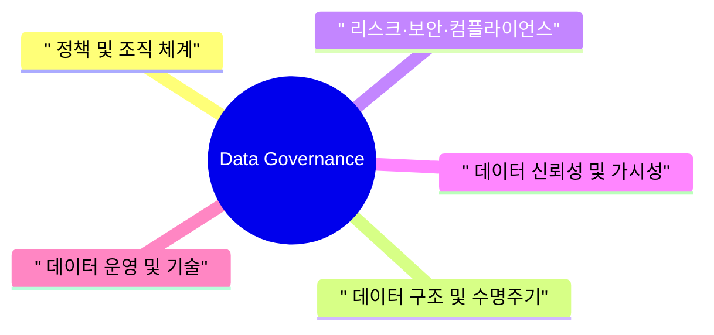
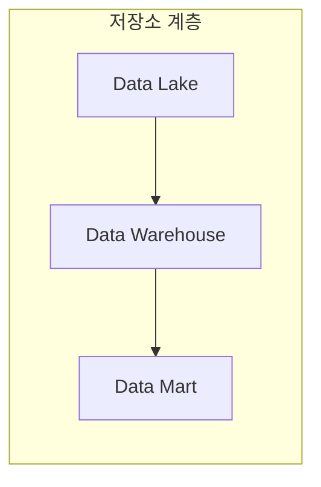
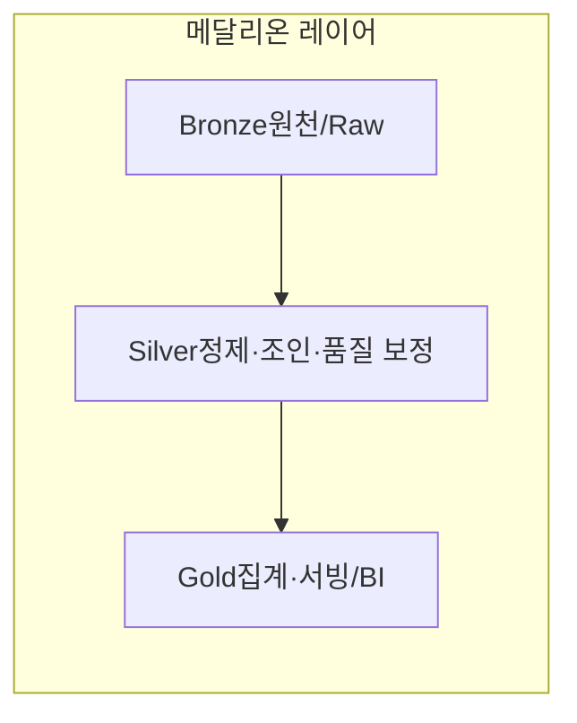
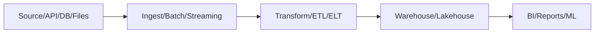

## 1. 데이터 거버넌스 개요
### 1.1 데이터 거버넌스 정의
데이터 거버넌스는 조직 내 모든 데이터를 일관된 원칙과 책임 구조 아래에서 관리·통제하기 위한 프레임워크이다.  
데이터의 품질, 보안, 가용성을 유지하면서 비즈니스 목표 달성을 지원하는 것을 핵심 역할로 한다.

### 1.2 적용 범위 및 목적
본 거버넌스 체계는 전사 데이터(운영 시스템, 분석 시스템, 외부 수집 데이터 등)와 이를 다루는 조직·프로세스·기술 전반에 적용된다.  
이를 통해 데이터 활용 시 발생할 수 있는 위험을 줄이고, 신뢰 가능한 데이터를 기반으로 한 의사결정을 가능하게 한다.

### 1.3 용어 정의
데이터 거버넌스 문서에서 사용하는 주요 용어(예: 데이터 소유자, 스튜어드, 골든 소스 등)를 명확히 정의하여 해석의 혼선을 방지한다.  
동일 용어에 대해 전사적으로 하나의 정의만 사용하도록 기준을 제시한다.

---

## 2. 정책 및 조직 체계
### 2.1 정책·표준 (Policies & Standards)
데이터 정책·표준은 데이터 생성·활용·보관 과정에서 반드시 지켜야 할 규칙과 기준을 문서화한 것이다.  
이를 통해 조직 구성원이 동일한 원칙 아래에서 데이터를 처리하도록 유도하고, 예외 상황을 최소화한다.

#### 2.1.1 데이터 관리 정책
데이터 관리 정책은 데이터 수집, 사용, 공유, 보존, 폐기에 대한 기본 원칙과 허용·금지 사항을 정의한다.  
특히 개인정보·민감정보와 같이 규제가 필요한 데이터에 대해 별도의 관리 기준을 명시한다.

#### 2.1.2 데이터 표준·명명 규칙
데이터 표준·명명 규칙은 테이블·컬럼·지표·파일명 등의 구조와 표기 방식을 통일하기 위한 규범을 의미한다.  
이를 통해 시스템이 달라도 데이터 구조를 직관적으로 이해하고 재사용·통합하기 쉽게 만든다.

#### 2.1.3 문서화 및 변경관리 원칙
문서화 및 변경관리 원칙은 데이터 관련 산출물(모델, 스키마, 사전, 정책 등)을 어떻게 기록·버전 관리·배포할 것인지에 대한 기준이다.  
변경 이력과 승인 내역을 추적 가능하게 해 향후 원인 분석과 감사 요구에 대응할 수 있도록 한다.

### 2.2 조직 및 책임 (Organization & Accountability)
조직 및 책임 체계는 데이터 거버넌스를 수행하기 위한 전담조직, 위원회, 역할 간 관계를 구조적으로 정의한다.  
각 조직이 수행해야 할 업무 범위와 상호 협의·조정 메커니즘을 함께 규정한다.

#### 2.2.1 데이터 조직 구조
데이터 조직 구조는 CDO 조직, 데이터 거버넌스 위원회, 도메인별 데이터 오너·스튜어드 등 핵심 주체의 구성과 소속을 나타낸다.  
각 조직이 담당하는 데이터 범위와 상호 보고 체계를 그림 또는 표 형태로 명확히 표현한다.

#### 2.2.2 역할 및 책임(R&R)
역할 및 책임은 데이터 소유자, 스튜어드, 프로듀서, 컨슈머 등 각 역할이 어떤 결정을 내리고 어떤 작업을 수행해야 하는지 상세히 기술한다.  
데이터 품질, 접근 권한, 변경 승인 등 책임 소재를 명확히 하여 업무 공백과 중복을 줄인다.

#### 2.2.3 의사결정 및 승인 프로세스
의사결정 및 승인 프로세스는 데이터 정책 제정, 스키마 변경, 민감정보 처리 등 주요 이슈에 대해 누구에게 어떤 절차로 승인받아야 하는지를 정의한다.  
심의·승인 단계, 회의체, SLA 기준 등을 함께 정해 의사결정의 일관성과 속도를 확보한다.

---

## 3. 데이터 구조 및 수명주기
### 3.1 데이터 아키텍처 (Data Architecture)
데이터 아키텍처는 전사 데이터가 어떤 시스템과 저장소를 거쳐 생성·보관·소비되는지를 구조적으로 표현한 청사진이다.  
이를 통해 중복 저장, 불필요한 인터페이스, 비표준 경로를 식별하고 개선할 수 있다.

#### 3.1.1 데이터 도메인 및 주제 영역
데이터 도메인 및 주제 영역은 비즈니스 관점에서 고객, 상품, 거래, 채널 등으로 데이터를 논리적으로 구분한 구조를 의미한다.  
각 도메인별로 책임 조직과 핵심 데이터셋을 정해 관리와 소유권을 명확하게 한다.

#### 3.1.2 레이크·DW·마트 구조

레이크·DW·마트 구조는 원천 데이터가 저장되는 레이크, 통합·정제된 분석용 데이터 웨어하우스, 특정 조직·업무용 데이터 마트 간의 계층 관계를 정의한다.  
각 계층에서 허용되는 데이터 가공 수준과 사용 목적을 구분하여 아키텍처의 일관성을 유지한다.

#### 3.1.3 메달리온 레이어 구조 (Bronze / Silver / Gold)

메달리온 레이어 구조는 원천 데이터가 레이크로 유입된 이후, 정제·통합·비즈니스 가공 단계를 거치며
Bronze(원천/Raw) – Silver(정제·조인·품질 보정) – Gold(비즈니스용 집계·서빙) 레이어로 점진적으로 고도화되는 패턴을 의미한다.  
이를 통해 파이프라인 단계별 책임과 품질 기준을 명확히 하고, 재사용 가능한 중간 레이어를 구축하여
데이터 중복 개발과 일관성 문제를 줄인다.

### 3.2 데이터 모델링 (Data Modeling)
데이터 모델링은 비즈니스 요구를 데이터 구조로 변환해 시스템에서 구현 가능한 형태로 정리하는 활동이다.  
일관된 모델링 원칙을 적용해 시스템 간 통합과 확장을 용이하게 한다.

#### 3.2.1 개념·논리·물리 모델 정의
개념 모델은 비즈니스 개체와 관계를 고수준에서 표현하고, 논리 모델은 이를 정규화된 구조로 구체화하며, 물리 모델은 실제 DBMS 특성을 반영해 테이블·인덱스로 구현한다.  
세 단계의 모델을 구분 관리함으로써 요구사항 변경과 시스템 변경을 유연하게 대응할 수 있다.

### 3.3 데이터 라이프사이클 관리 (Lifecycle Management)
데이터 라이프사이클 관리는 데이터가 처음 생성되는 시점부터 보존, 아카이빙, 최종 폐기에 이르기까지의 전 과정을 관리하는 체계이다.  
각 단계별로 보안, 품질, 비용 관점의 통제 기준을 설정하여 데이터의 전체 생애를 통제한다.

#### 3.3.1 생성·수집·저장
생성·수집·저장 단계에서는 데이터가 어떤 채널·시스템을 통해 유입되는지 정의하고, 수집 시점에 최소한의 품질·검증 절차를 설계한다.  
저장 위치, 포맷, 중복 허용 여부, 기본 보존 기간 등을 표준화하여 무분별한 적재를 방지한다.

#### 3.3.2 활용·보존·폐기 기준
활용·보존·폐기 기준은 데이터가 어느 기간 동안 어떤 목적으로 사용될 수 있는지와, 이후 어떻게 아카이브 또는 삭제해야 하는지를 규정한다.  
법적·규제 요구와 비즈니스 효용을 함께 고려해 보존 기간을 설정하고, 폐기 시에는 비가역적 삭제·마스킹 기준을 명시한다.

#### 3.3.3 저장 계층 전략 (HOT / WARM / COLD)
HOT / WARM / COLD 저장 계층 전략은 데이터의 접근 빈도와 지연 요구 수준에 따라
고성능(Hot), 중간 성능(Warm), 저비용 장기 보관(Cold) 계층으로 나누어 저장하는 방식이다.  
이를 통해 라이프사이클 단계별로 비용·성능·가용성 균형을 최적화하고, 보존 정책과 아카이빙 전략을 일관되게 적용할 수 있다.

## 4. 데이터 신뢰성 및 가시성
### 4.1 데이터 품질 (Data Quality Management)
데이터 품질 관리는 성능 정확성, 완전성, 일관성, 적시성 등 정의된 품질 기준을 충족하도록 데이터를 지속적으로 점검·개선하는 활동이다.  
업무 흐름 속에 품질 검증·정제·승인 과정을 내재화하여, 신뢰할 수 있는 데이터만이 분석·의사결정에 사용되도록 보장한다.

#### 4.1.1 품질 기준 및 지표 정의
품질 기준 및 지표 정의는 각 데이터셋에 대해 어떤 수준의 정확도·누락률·중복 허용 범위가 적정한지를 수치화해 설정하는 작업이다.  
이러한 기준을 품질 지표(KPI)로 관리함으로써 품질 상태를 정량적으로 측정하고 목표 대비 개선 여부를 평가할 수 있다.

#### 4.1.2 품질 검증·정제·이슈 관리 프로세스
품질 검증·정제·이슈 관리 프로세스는 데이터 적재·변환 단계에서 자동·수동 검증을 수행하고, 오류 데이터를 정제·보정하는 절차를 정의한다.  
품질 이슈는 등록·분석·조치·재검증의 단계로 관리하며, 원인과 조치 이력을 기록해 재발 방지와 프로세스 개선에 활용한다.

### 4.2 모니터링·KPI·Observability (Monitoring & Metrics)

모니터링·KPI·Observability는 데이터와 파이프라인이 의도한 대로 작동하는지 실시간 또는 주기적으로 관찰하고 지표화하는 체계이다.  
단순 장애 여부를 넘어 지연, 데이터량, 오류율 등 운영·품질 관점의 신호를 종합적으로 수집해 이상 징후를 조기에 탐지한다.

#### 4.2.1 데이터·파이프라인 모니터링
데이터·파이프라인 모니터링은 배치·실시간 작업의 성공/실패, 처리량, 지연 시간, 재시도 횟수 등을 지속적으로 수집·시각화하는 활동이다.  
경고 임계치와 알림 채널을 사전에 정의해, 문제 발생 시 즉시 담당자에게 통보하고 신속히 원인 분석과 복구가 이뤄지도록 한다.

---

## 5. 리스크·보안·컴플라이언스
### 5.1 보안·개인정보 보호 (Security & Privacy)
보안·개인정보 보호는 데이터의 기밀성, 무결성, 가용성을 보장하고, 특히 개인정보·민감정보가 무단 접근·유출되지 않도록 통제하는 영역이다.  
기술적·관리적 보호 조치를 함께 정의해, 시스템·조직·사용자 행위 전반에서 일관된 보안 수준을 유지한다.

#### 5.1.1 접근권한 및 인증 관리
접근권한 및 인증 관리는 사용자·시스템의 정체성을 검증하고, 최소 권한 원칙에 따라 필요한 데이터에만 접근을 허용하는 체계를 의미한다.  
역할 기반 접근통제(RBAC)와 정기적인 권한 검토를 통해 불필요하거나 과도한 권한을 지속적으로 제거한다.

#### 5.1.2 암호화·마스킹·로그 및 감사
암호화·마스킹·로그 및 감사 항목은 저장·전송 중인 데이터를 암호화하고, 화면·리포트에서 민감정보를 마스킹하는 기술적 통제를 정의한다.  
또한 접근·조회·변경 내역을 로그로 남기고 주기적 감사 절차를 통해 이상 행위나 규정 위반을 탐지·조치한다.

#### 5.1.3 개인정보 처리 기준 및 보호 조치
개인정보 처리 기준 및 보호 조치는 수집 목적, 보유 기간, 활용 범위 등 개인정보 처리 전 과정을 규정하는 내부 원칙을 의미한다.  
법령과 내부 정책에 따라 비식별화, 접근 제한, 파기 절차 등을 세부적으로 정의해 개인정보 침해 위험을 최소화한다.

### 5.2 리스크·컴플라이언스 관리 (Risk & Compliance)
리스크·컴플라이언스 관리는 데이터 관련 법적·규제적 요구사항과 내부 정책 준수 여부를 상시 점검하는 활동이다.  
데이터 활용으로 발생할 수 있는 운영·보안·평판 리스크를 체계적으로 관리해 조직의 전반적인 위험 수준을 통제한다.

#### 5.2.1 규제·법적 요구사항 대응
규제·법적 요구사항 대응은 개인정보보호법, 금융 규제, 산업별 가이드라인 등 외부 규범을 분석해 데이터 관리 기준에 반영하는 작업이다.  
규정 개정 시 영향 범위를 검토하고, 필요한 정책·절차·시스템 변경을 계획·실행해 위반 리스크를 사전에 방지한다.

#### 5.2.2 데이터 리스크 식별·평가
데이터 리스크 식별·평가는 데이터 수집·저장·전송·분석 과정에서 발생 가능한 보안·품질·운영 상의 위험 요소를 파악하는 단계이다.  
위험의 발생 가능성과 영향도를 평가하여 우선순위를 정하고, 이에 맞는 통제·완화 전략을 수립한다.

#### 5.2.3 점검·감사 및 개선 활동
점검·감사 및 개선 활동은 정책 준수 여부, 통제 수단의 효과성, 운영 프로세스의 적정성을 주기적으로 검토하는 절차를 포함한다.  
점검 결과에서 도출된 취약점과 권고 사항을 기반으로 개선 과제를 정의하고, 이행 상황을 추적 관리한다.

## 6. 데이터 운영 및 기술
### 6.1 데이터 운영 프로세스 (Operations & Workflow)
데이터 운영 프로세스는 데이터 파이프라인, 적재 작업, 스케줄링, 모니터링 등의 일상 운영 절차를 정의한 것이다.  
장애 대응, 롤백, 재처리 기준을 포함해 안정적인 운영을 위한 공통 규칙을 제시한다.

#### 6.1.1 배치·실시간 파이프라인 운영
배치·실시간 파이프라인 운영 항목은 배치(일/시간 단위) 작업과 스트리밍 처리의 설계·스케줄링·모니터링 원칙을 구분해 설명한다.  
지연 허용 범위, 재처리 전략, 운영 지표(KPI)를 정의하여 파이프라인 품질을 관리한다.

#### 6.1.2 변경요청·배포·릴리즈 관리
변경요청·배포·릴리즈 관리는 스키마 변경, 새로운 파이프라인 추가, 정책 적용 등의 변경 사항을 어떻게 접수·검토·배포할지에 대한 절차를 규정한다.  
테스트 환경 검증, 승인 권한, 롤백 플랜을 명시해 변경으로 인한 서비스 영향과 데이터 리스크를 최소화한다.
### 6.2 데이터 거버넌스 기술 
| 구분                          | OpenMetadata (오픈소스) | DataHub (오픈소스) | Apache Atlas (오픈소스) | Snowflake Horizon Catalog (유료) | Oracle Data Platform (유료) |
|-------------------------------|-------------------------|--------------------|-------------------------|----------------------------------|-----------------------------|
| 1. 정책·표준                  | O                       | O                  | O                       | O                                | O                           |
| 2. 조직 및 책임               | O                       | O                  | O                       | O                                | O                           |
| 3. 데이터 품질               | O                       | △                  | △                       | △                                | △                           |
| 4. 메타데이터 & 카탈로그      | O                       | O                  | O                       | O                                | O                           |
| 5. 보안·개인정보 보호         | △                       | △                  | O                       | O                                | O                           |
| 6. 데이터 아키텍처            | O                       | O                  | O                       | O                                | O                           |
| 7. 데이터 모델링              | △                       | △                  | △                       | △                                | O                           |
| 8. 데이터 라이프사이클 관리   | △                       | △                  | △                       | O                                | O                           |
| 9. 데이터 운영 프로세스       | △                       | △                  | X                       | O                                | O                           |
| 10. 플랫폼 확장성              | O                       | O                  | △                       | O                                | O                           |
| 11. 모니터링| △                       | △                  | X                       | O                                | O                           |
| 12. 리스크·컴플라이언스 관리  | △                       | △                  | O                       | O                                | O                           |

| 명칭                       | O 개수 | △ 개수 | X 개수 | 원점수(2·O + 1·△) |
|------------------------------|--------|--------|--------|-------------------|
| OpenMetadata (오픈소스)      | 6      | 6      | 0      | 18                |
| DataHub (오픈소스)           | 5      | 7      | 0      | 17                |
| Apache Atlas (오픈소스)      | 6      | 4      | 2      | 16                |
| Snowflake Horizon (유료)     | 10     | 2      | 0      | 22                |
| Oracle Data Platform (유료)  | 11     | 1      | 0      | 23                |

  [Oracle Data Platform (유료) 23/24 #######################]

  [Snowflake Horizon (유료) 22/24 ######################]

  [OpenMetadata (오픈소스) 18/24 ##################]

  [DataHub (오픈소스) 17/24 #################]

  [Apache Atlas (오픈소스) 16/24 ################]

